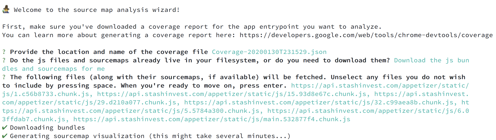

# 🧙‍♂️ sourcemap-wizard

This small command line utility is built on top of [source-map-explorer](https://github.com/danvk/source-map-explorer) to help you more easily create visualizations of the bundles fetched for any specific entry point of an app.

The wizard simply:

1. Extracts relevant js bundle names from your [provided coverage json file](#more-info)
2. Fetches those js bundles along with their sourcemaps
3. Feeds that information into source-map-explorer for you

## Example

Here's a visualization of the js bundles fetched by Pinterest on the mobile home screen, with the color red indicating the code that was mostly unused during the bootup of the app:

## Installation

### For global access:

`npx sourcemap-wizard`

### Or in a project:

`npm install sourcemap-wizard`

## More info

First, you'll need to use the Chrome browser to [generate the coverage report](https://developers.google.com/web/tools/chrome-devtools/coverage) for the entry point you wish to analyze.

The wizard will walk you through the process of linking to the proper js bundles and sourcemaps to create the visualization. If you don't have them locally, it will conveniently download them for you.

**Note:** this requires sourcemaps to be available. It might be helpful to point to a testing instead of prod build, as for some apps, sourcemaps are disabled in production.

### Here's what a run through the wizard might look like:

## How to contribute

This project is very new&mdash; if you find a bug or have a suggestion for improvement, please make an issue.
