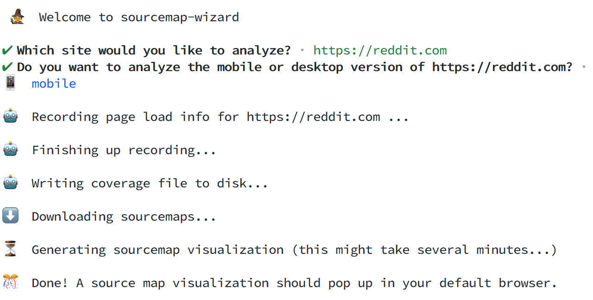

# 🧙‍♂️ sourcemap-wizard

This command line utility is built on top of [`source-map-explorer`](https://github.com/danvk/source-map-explorer) to make it very easy to create visualizations of which JS bundles were fetched for any specific entry point of an app.

`sourcemap-wizard` simply takes a url and generates a visualization that shows you:

1. All first-party JS bundles that were loaded on the page.
2. What percent of each part of those bundles was actually used to render the page.

### Reddit mobile homepage

## Quick start

`npx source-map-wizard`.

That's it! The wizard will walk you through the rest.

## Requirements

1. Downloadable sourcemaps

   This utility downloads sourcemaps from the url you provide. This requires the sourcemaps to be publically available, or at least available on your network. You might need to point to a testing instead of production build, for instance, as some apps disable sourcemaps in production.

2. A local Chrome installation

   The wizard uses `puppeteer-core` to load coverage information from the provided url. This requires you to have a fairly up-to-date version of Chrome installed on your machine.

## Optional command line arguments

### `url`

To skip the first prompt, provide a url as an initial argument:

`npx sourcemap-wizard nytimes.com`

### `desktop` flag

By default, `sourcemap-wizard` will analyze a mobile version of the site. To analyze the desktop version instead, pass the `--desktop` flag:

`npx sourcemap-wizard --desktop`

### `debug` flag

If you'd like to see more logging and detailed error messages, add this flag.

`npx sourcemap-wizard --debug`

## Example Run Through

## Credits

This library is based on [`source-map-explorer`](https://github.com/danvk/source-map-explorer).
