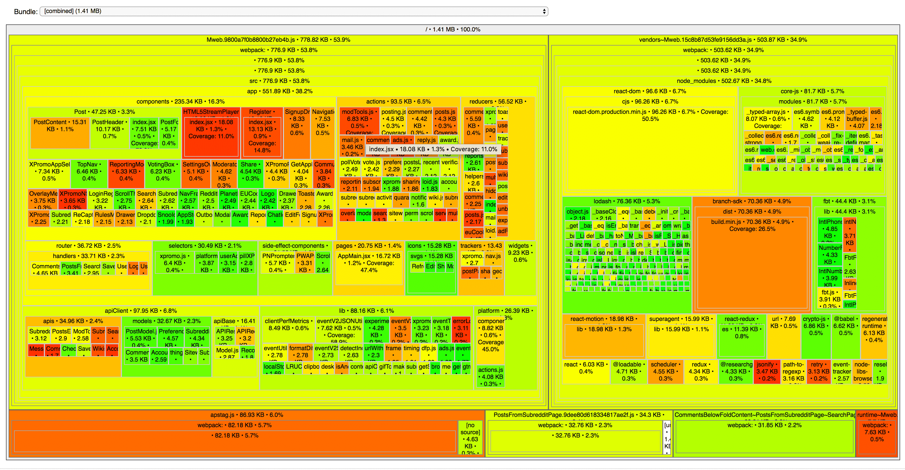

# 🧙‍♂️ bundle-wizard

This command line utility makes it simple to create visualizations of the JS bundles that were fetched for any specific entry point of an app.

## Quick start

`npx bundle-wizard`

That's it! The wizard will walk you through the rest.

(You can also do the standard `npm install -g bundle-wizard`, and then run `bundle-wizard` if you plan on using the tool often).

## Example

Visualizing JS loaded by Reddit's mobile homepage:

[Check out a live demo of this visualization](https://bundle-wizard.surge.sh)

## Optional command line arguments

### `url` (initial argument)

To skip the prompt, provide a url as an initial argument:

`npx bundle-wizard nytimes.com`

### `desktop` flag

By default, `bundle-wizard` will analyze a mobile version of the site. To analyze the desktop version instead, pass the `--desktop` flag:

`npx bundle-wizard --desktop`

### `debug` flag

If you'd like to see more logging and detailed error messages, add this flag.

`npx bundle-wizard --debug`

## Credits

The core functionality of this library is provided by the awesome [`source-map-explorer`](https://github.com/danvk/source-map-explorer).

## Requirements

1. Downloadable sourcemaps

   This utility downloads sourcemaps from the url you provide. This requires the sourcemaps to be publically available, or at least available on your network. You might need to point to a testing instead of production build, for instance, as some apps disable sourcemaps in production.

2. A local Chrome installation

   The wizard uses `puppeteer-core` to load coverage information from the provided url. This requires you to have a fairly up-to-date version of Chrome installed on your machine.
